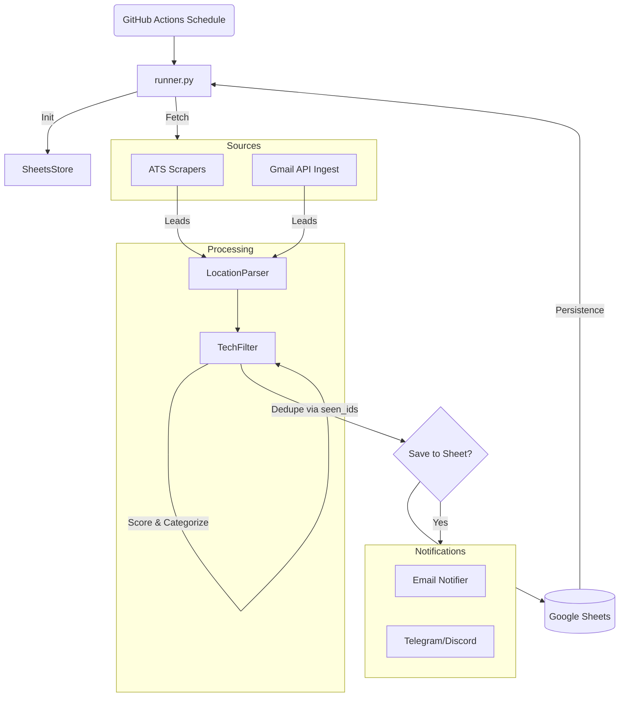

# US Tech Job Finder

A compliance-first, production-ready system to find US tech job opportunities hourly, store them in Google Sheets, and notify via Email/Telegram/Discord.

## Architeture



## Features
- **Hourly Updates**: Runs on GitHub Actions.
- **Google Sheets Database**: Append-only log + applied tracker.
- **Smart Filtering**: Regex + Scoring for Tech roles.
- **Multi-Channel**: Email Digest + Instant Telegram Alerts.
- **LLM ready**: Architecture supports LLM-based parsing (optional).

## Setup Instructions

### 1. Google Cloud Setup
1. Create a Project in Google Cloud Console.
2. Enable **Google Sheets API** and **Gmail API**.
3. Create a **Service Account**, download `service_account.json`.
4. Share your Google Sheet with the Service Account email.

### 2. Configuration
1. Copy `config/config.yaml.example` to `config/config.yaml`.
2. Edit preference (keywords, locations).

### 3. Secrets (Environment Variables)
For local run, use `.env` file. For GitHub Actions, set these in Repository Secrets:

- `GOOGLE_APPLICATION_CREDENTIALS_JSON_BASE64`: Base64 encoded content of your `service_account.json`.
- `TELEGRAM_BOT_TOKEN` / `TELEGRAM_CHAT_ID`: For alerts.
- `EMAIL_APP_PASSWORD`: For sending emails via SMTP.
- `GROQ_API_KEY` etc: If using LLM.

### 4. Running Locally
```bash
pip install -r requirements.txt
python runner.py
```

### 5. Running Tests
```bash
pytest tests/
```

## Folder Structure
- `sources/`: Scrapers and Gmail reader.
- `filters/`: Filtering logic.
- `storage/`: Google Sheets integration.
- `llm/`: AI Manager.
- `notifiers/`: Alert backends.
